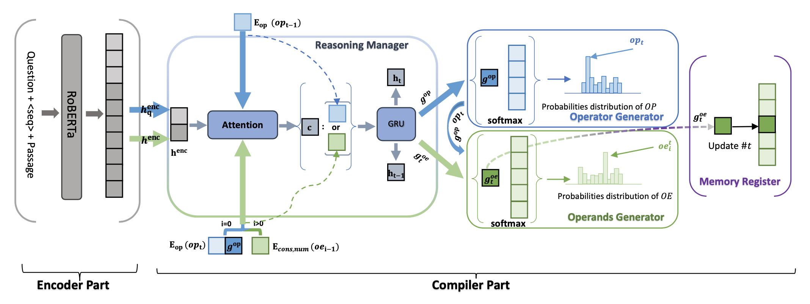

# ELASTIC: Numerical Reasoning with Adaptive Symbolic Compiler

<!-- This repository is the official implementation of [My Paper Title](https://arxiv.org/abs/2030.12345).  -->
This repository is the official implementation of [ELASTIC: Numerical Reasoning with Adaptive Symbolic Compiler]() accepted by NeurIPS 2022.

<!-- >📋  Optional: include a graphic explaining your approach/main result, bibtex entry, link to demos, blog posts and tutorials -->


## Requirements

To install requirements:

```setup
pip install -r requirements.txt
```

>  - Python version should be greater than or equal to 3.7.
>  - All the hyper-parameters and configuration settings on in the `configuration.py`. However, please specify the values in the bash files unders `./bash_script` directors.

## Pre-Process
To preprocess the file to the model desires, run the following command:
```preprocess
cd bash_script
./start_process.sh
```
> - For either FinQA or MathQA dataset, just uncomment the correspoding code block, which prefers the absolute path for the files.
> - The processed files have been saved into `SAVE_DIR`(argument in `start_process.sh`), so you don't need to process the files by yourself, unless intend to.
> - Append `force` to the command, like "./start_process.sh force" if there are already processed files under the default `SAVE_DIR`. This will overwrite the existing processed files. Otherwise, without the `force`, will report error.

## Training

To train the model(s) in the paper, run this command:

```train
cd bash_script
./start_train.sh
```

> - Data Path: This is similar to the pre-process step, just uncomment the path information of the data set you want (FinQA or MathQA).
>   -    **If you do not want to select best parameters during train process by evaluating on dev data, you can just pass the test data to `DEV_DATA`, which evaluate the model after each epoch on the test data.**
> - Customized Hyper-Parameters:
>   -    `MAX_OP_LEN` and `MAX_ARGU_LEN`: for FinQA: 7 and 2. for MathQA: 15 and 4.
>   -    `MAX_EPOCH`: for FinQA: 50. for MathQA: 100.
>   -    **Please don't change other parameters, since no need to do this. Unless, you know exactly why you want to do this. For example, change the model saved directory.**
> - *The experiments are training on A100 GPU with 40GB memory. The train batch size is set to 10, and the tranining time for FinQA and MathQA could be: 10h and 48h, respectively.*

## Evaluation

To evaluate my model, run:

```eval
cd bash_script
./start_test.sh
```
> - Data Path: This is similar to the train step, just uncomment the path information of the test data set you want (FinQA or MathQA).
>   -    **If you want use test data for evaluation during train, there is no need here to re-evaluate on the test data, just go to the `MODEL_SAVE_DIR` to use the best precition file for calculating the metrics.**
> - Customized Hyper-Parameters:
>   -    `MAX_OP_LEN` and `MAX_ARGU_LEN`: for FinQA: 7 and 2. for MathQA: 15 and 4.
> - Reload Model Path:
>   -    `RELOAD_MODEL_PATH`: please change this to the saved model, there is an example value following it in the bash file.
> - **Please don't change other parameters, since no need to do this. Unless, you know exactly why you want to do this. For example, change the model saved directory.**

After obtaining the prediction results, you need to calculate the **Prog Acc** and **Exe Acc** for FinQA, run:
```eval
cd models
python calculate_metrics_finqanet.py
```
> - You have to specify the predcition and golden files paths:
>   -    `json_in`: prediction file path. `"../prediction_results/3_test_results_finqa_NrHd_RoBERTa-large.json"` is the prediction file provided by us, which is the prediction results of our model **ELASTIC (RoBERTa-large)** on **FinQA** test data. 
>   -   `json_ori`: original retrieved data.
>   -   `our_gold_json`: the processed test data on Pre-Process step.
An example as below. **The metrics code for FinQA is different with code for MathQA, since `calculate_metrics_finqanet.py` is the same as the original code of FinQA paper. However, with slightly change, supporting ablation study, etc. No code relevant with metric algorithm is changed, so the result is fair when compared with baseline FinQANet.**
```
    evaluate_result(
        json_in="../prediction_results/3_test_results_finqa_NrHd_RoBERTa-large.json",
        json_ori="../datasets/raw_data/finqa/test_retrieve.json",
        our_gold_json="../datasets/cached_data/finqa/cached_test_data.json"
    ) 
```

for MathQA, run:
```eval
cd models
python calculate_metrics.py
```
> - You have to specify the predcition and golden files paths:
>   - Sub `mathqa_prediction_file_path`: prediction file path. `"../prediction_results/4_finqanet_mathqa_roberta-large.json"` is the prediction file provided by us, which is the prediction results of our model **ELASTIC (RoBERTa-large)** on **MathQA** test data. 
>   - Sub `mathqa_gold_file_path`: the processed test data on Pre-Process step.

Other provided prediction file under `./prediction_results` directory:
> `1_test_results_mathqa_NrHd_RoBERTa-base.json`: **ELASTIC (RoBERTa-base)** on **MathQA** test prediction results.
> `2_converted_finqa_FinQANet_RoBERTa-large_full_results.json`: **FinQANet (RoBERTa-base)** on **FinQA** test prediction results, whose FinQANet model is trained by ourself. The json data is converted from the `2_finqa_FinQANet_RoBERTa-large_full_results.json`, by function `convert_original_file_to_we_want()` of `calculate_metrics.py`.
> `4_finqanet_mathqa_roberta-large.json`: **FinQANet (RoBERTa-base)** on **MathQA** test prediction results.

## Pre-trained Models

You can download pretrained models here:

- [ELASTIC (RoBERTa-large) for FinQA](https://drive.google.com/file/d/1UEBbFMSYWuIe65LsZQT6SuFsZBA7xD7m/view?usp=sharing).
- [ELASTIC (RoBERTa-large) for MathQA](https://drive.google.com/file/d/1Q6XEstn678tzHMxiaOKLJpqtQot_2T1s/view?usp=sharing).

> - For evaluation use:
>   - Sub: the same as **Evaluation** step, chagne the `RELOAD_MODEL_PATH` to the name of download pre-trained file name.
> - For re-train use:
>   - Sub: change the configurations paths for the following arguments (following values are examples):
```
# RELOAD_MODEL_PATH=${MODEL_SAVE_DIR}/checkpoint_best_0.68.pt
# RELOAD_CONFIG_PATH=${MODEL_SAVE_DIR}/checkpoint_best_0.68.ct
# RELOAD_OPTIMIZER_PATH=${MODEL_SAVE_DIR}/checkpoint_best_0.68.op
# RELOAD_SCHEDULER_PATH=${MODEL_SAVE_DIR}/checkpoint_best_0.68.lr
```
>   - Sub: then add the values to the `PATH_ARGS` like below (or just uncomment the corresponding code):
```
PATH_ARGS="--data_name ${DATA_NAME} \
           --cached_train_data ${TRAIN_DATA} \
           --cached_dev_data ${DEV_DATA} \
           --model_save_dir ${MODEL_SAVE_DIR} \
           --eval_results_dir ${EVAL_RESULTS_DIR}  \
           --cached_test_data ${TEST_DATA} \
           --reload_model_path ${RELOAD_MODEL_PATH} \
           --reaload_config_path ${RELOAD_CONFIG_PATH} \
           --reload_optimizer_path ${RELOAD_OPTIMIZER_PATH} \
           --reload_scheduler_path ${RELOAD_SCHEDULER_PATH}"
```

## Results

Our model achieves the following performance:

| Model and Datasets      | FinQA (test)  |  FinQA (test)| MathQA (test) |
| ----------------------- |----------|--------- | ------------- |
|                         | Exe Acc | Prog Acc | Prog Acc      |
| Graph2Tree              |  0.37   |   0.0    |   69.96       |
| NumNet                  |  2.32   |   n/a    |   n/a         |
| NumNet+                 |  10.29  |   n/a    |   n/a         |
| NeRd                    |  52.48  |  49.90   |   79.7        |
| FinQANet(RoBERTa-base)  | 60.10   |  58.38   |   74.12       |
| FinQANet(RoBERTa-large) |  65.05  |  63.52   |   79.20       |
| ELASTIC (RoBERTa-base)  |  62.66  |  59.28   |   82.27       |
| ELASTIC (RoBERTa-large) | **68.96** | **65.21** | **83.00**  |
| Human Expert            |  91.16  |  87.49   |    n/a        |
| Human Non-Expert        |  50.68  |  48.17   |    n/a        |

>📋  All results are from our experiments, FinQA paper, or origianl papers.


## Contributing

[](./LICENSE)